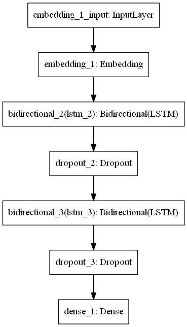
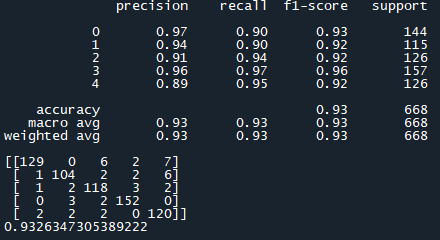
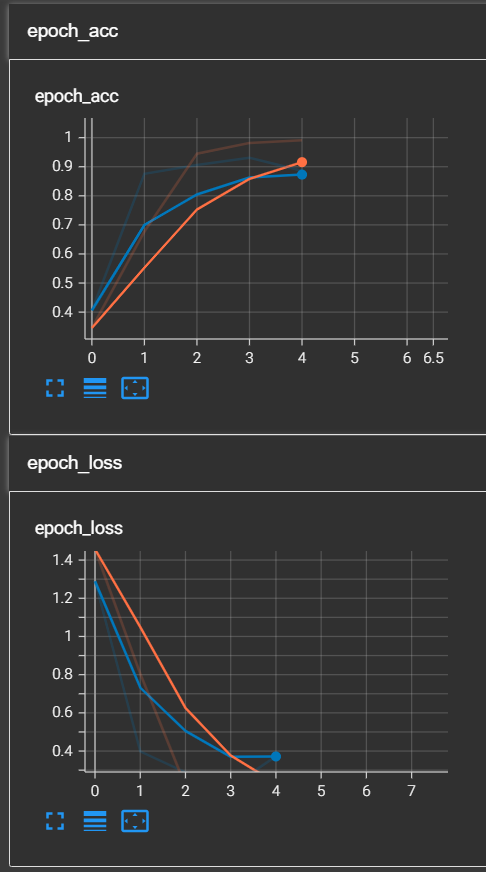

# Article Categorizing (Deep Learning)
 Text documents are essential as they are one of the richest sources of data for businesses. Text documents often contain crucial information which might shape the market trends or influence the investment flows. Therefore, companies often hire analysts to monitor the trend via articles posted online, tweets on social media platforms such as Twitter or articles from newspaper. However, some companies may wish to only focus on articles related to technologies and politics. Thus, filtering of the articles into different categories is required.

# Description

Human language is astoundingly complex and diverse. We express ourselves in infinite ways, both verbally and in writing. Not only are there hundreds of languages and dialects, but within each language is a unique set of grammar and syntax rules, terms and slang. When we write, we often misspell or abbreviate words, or omit punctuation. When we speak, we have regional accents, and we mumble, stutter and borrow terms from other languages. 

While supervised and unsupervised learning, and specifically deep learning, are now widely used for modeling human language, there’s also a need for syntactic and semantic understanding and domain expertise that are not necessarily present in these machine learning approaches. NLP is important because it helps resolve ambiguity in language and adds useful numeric structure to the data for many downstream applications, such as speech recognition or text analytics.

# How to use

1. Clone this repository and use saved model, encoder and tokenizer inside the "saved_models" folder to be deployed to your dataset
2. You can also use the modules that I have created in the "nlp_modules.py".
3. Don't forget to include the init.py blank file.
4. Run tensorboard at the end of training to see how well the model perform via conda prompt. Activate the desired environment and proper working directory
5. Type "tensorboard --logdir "the log path"
6. Paste the local network link into your browser and it will automatically redirected to tensorboard local host and done! Tensorboard is now can be analyzed.

# The Architecture of my Model

# Performance of my Model

# Tensorboard Screenshot from my Browser

# Discussion

As per requested from the question file, we have to obtain the accuracy of > 70% and the F1 score of 0.7. I have successfully obtained more than the requirement.
Lets discuss about this project accuracy:

1. I can obtain that accuracy mostly because of the training dataset is very good and my deep learning LSTM model can learn without any problem.
2. The process of data cleaning went smoothly and successfully. 
3. I have trained my model with low number of epochs (which is 5) just because of my machine is not that good to run with higher number of epochs, but 5 epochs was actually not that bad!
4. 64 nodes and 2 layers was good enough for my model to train with this dataset.
5. Obviously, you can achieve higher accuracy with higher number of nodes, layer and even epochs! Do try it yourself!

To conclude everything, this model is actually satisfactory (at least for me). I am looking forward to do more analysis with different datasets and I will update more on my GitHub page!

# Credit

shout out to the owner of our dataset: https://raw.githubusercontent.com/susanli2016/PyCon-Canada-2019-NLP-Tutorial/master/bbc-text.csv

